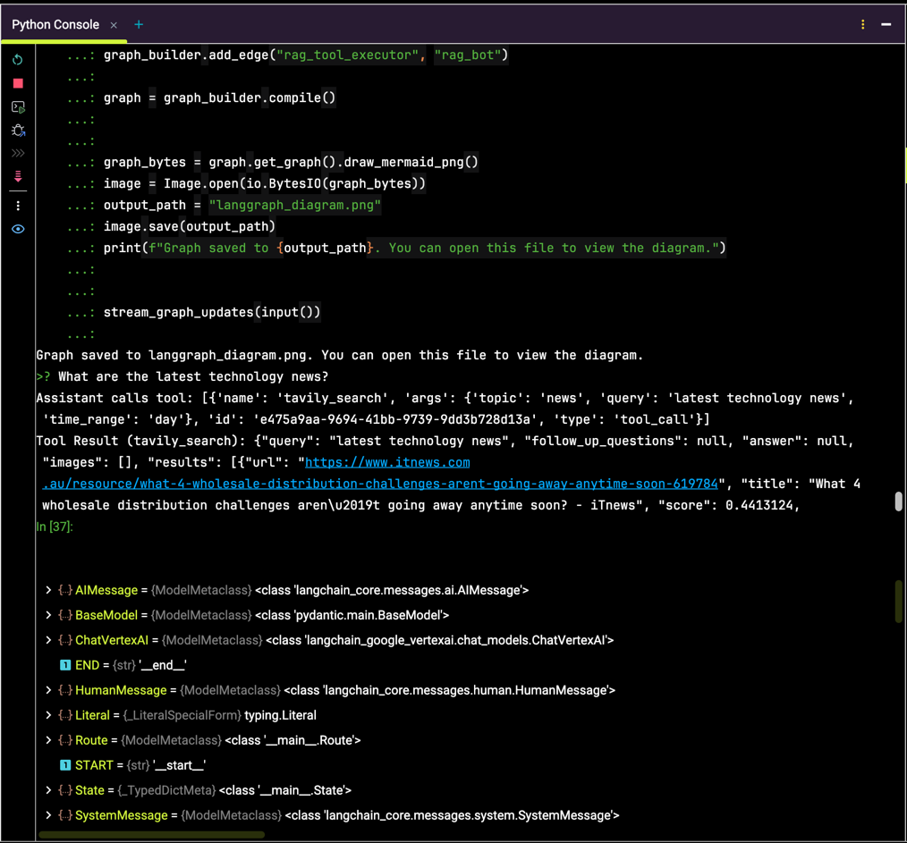
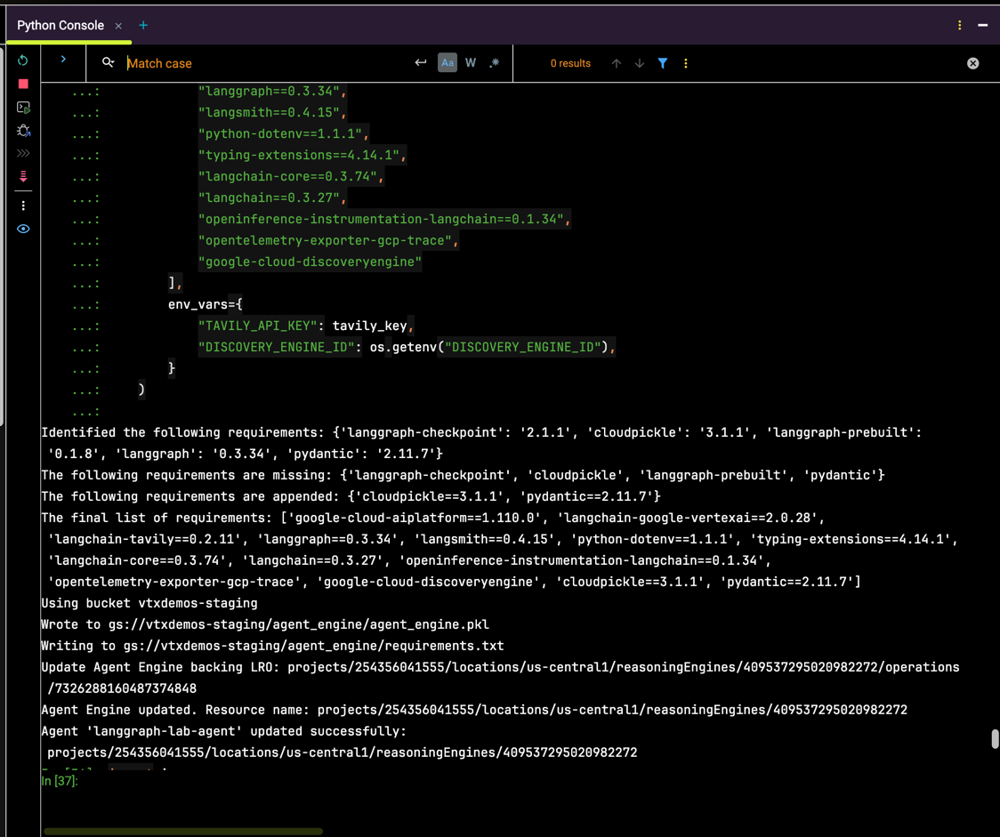
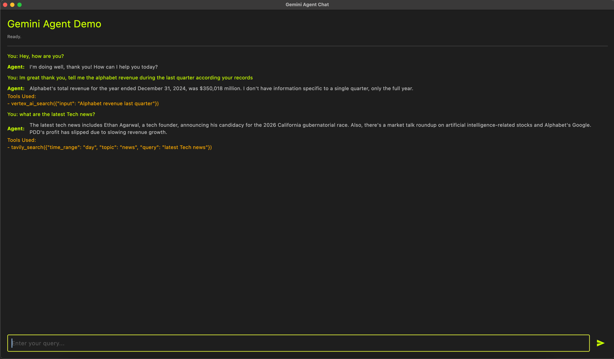

```bash
source /Users/jesusarguelles/IdeaProjects/hackathon-adk-on-gcp/a2a/.venv/bin/activate
uv pip install flet "flet[all]==0.28.3"
```

[agent.py](./agent.py): has a local testing code, the only requirements is to have either service account authenticated
or use ADC (Application Default Credentials) in your local PC.

Something like this is returned:



[agent_engine.py](agent_engine.py), takes the agent tested before and wrap it in a Custom Class so it can be deployed in
Agent Engine.

Once deployed or updated, the output should look like this:



Next step is to plug the Agent Engine into a Custom UI:

```bash
flet run frontend_agent_engine.py
```

[frontend_agent_engine.py](frontend_agent_engine.py)

